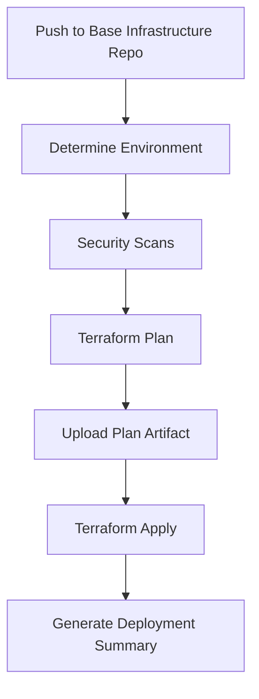
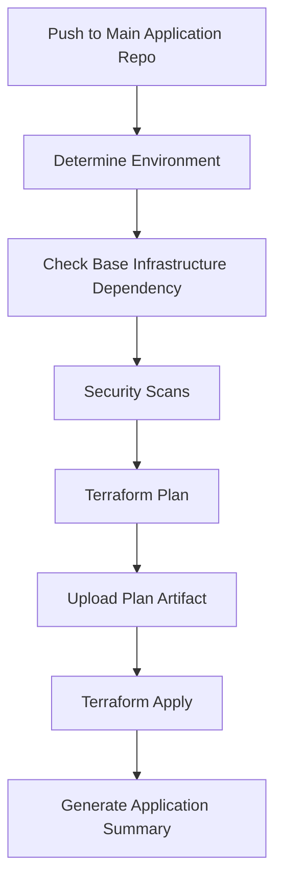

# 🚀 Standardized CI/CD Pipeline Documentation

## Overview

Both the **Cosine2.0** (main application) and **Cosine-Base-Infra** (base infrastructure) repositories now use a standardized, reusable CI/CD pipeline for consistent deployment practices.

## 📋 Repository Structure

### Main Application Repository (Cosine2.0)
```
.github/workflows/
├── deploy-application.yml          # Main application deployment workflow
├── cleanup.yml                     # Infrastructure cleanup workflow  
└── reusable/
    └── terraform-pipeline.yml     # Shared reusable pipeline
```

### Base Infrastructure Repository (Cosine-Base-Infra)
```
.github/workflows/
├── deploy-base-infrastructure.yml  # Base infrastructure deployment workflow
└── reusable/
    └── terraform-pipeline.yml     # Shared reusable pipeline (identical copy)
```

## 🔧 Pipeline Features

### Standardized Capabilities
- ✅ **Multi-Environment Support**: Development, Staging, Production
- ✅ **Security Scanning**: TFLint, tfsec, Checkov integration
- ✅ **Dependency Management**: Base infrastructure dependency checking
- ✅ **Artifact Management**: Plan files uploaded/downloaded between jobs
- ✅ **Environment Protection**: GitHub environments for approval workflows
- ✅ **Comprehensive Logging**: Step-by-step deployment summaries
- ✅ **Rollback Support**: Destroy functionality with safety checks

### Infrastructure-Specific Features
- 🏗️ **Base Infrastructure**: VPC, subnets, Lambda layers, shared resources
- 🖥️ **Application Infrastructure**: Frontend, API Gateway, CloudFront, application-specific resources

## 🎯 Workflow Triggers

### Automatic Triggers
- **Push to main**: Deploys to production environment
- **Push to develop**: Deploys to staging environment
- **Push to staging**: Deploys to staging environment
- **Pull Requests**: Runs plan and security scans (no deployment)

### Manual Triggers
- **Workflow Dispatch**: Deploy to any environment manually
- **Destroy Option**: Safely destroy infrastructure with confirmations

## 🔐 Security & Best Practices

### Security Scanning
```yaml
Security Tools:
├── TFLint        # Terraform linting and validation
├── tfsec         # Security static analysis
└── Checkov      # Infrastructure security scanning
```

### Environment Protection
- **Development**: Automatic deployment
- **Staging**: Automatic deployment with validation
- **Production**: Manual approval required (GitHub Environments)

### State Management
```yaml
Backend Configuration:
├── S3 Bucket: cosine-terraform-state-bucket
├── DynamoDB Locks: cosine-terraform-locks
└── Environment-Specific Keys:
    ├── base-infra/{environment}/terraform.tfstate
    └── application/{environment}/terraform.tfstate
```

## 📊 Deployment Flow

### 1. Base Infrastructure Deployment


### 2. Application Infrastructure Deployment


## 🛠️ Using the Pipeline

### For Base Infrastructure Team
1. **Make Changes**: Update Terraform files in `Cosine-Base-Infra/terraform/`
2. **Create PR**: Push changes and create pull request
3. **Review Plan**: Check Terraform plan in PR comments
4. **Merge**: Deploy automatically to target environment
5. **Monitor**: Check deployment summary in Actions tab

### For Application Team
1. **Ensure Base Infrastructure**: Verify base infrastructure is deployed
2. **Make Changes**: Update Terraform files in `Cosine2.0/terraform/`
3. **Create PR**: Push changes and create pull request
4. **Review Plan**: Check Terraform plan in PR comments
5. **Merge**: Deploy automatically to target environment
6. **Test Application**: Verify deployment at provided URLs

## 🔄 Environment Management

### Environment Variables
Both repositories require these secrets in GitHub:
- `AWS_ACCESS_KEY_ID`: AWS access key for deployments
- `AWS_SECRET_ACCESS_KEY`: AWS secret key for deployments

### Environment-Specific Configuration
Each environment has its own:
- Backend configuration file (`backend-configs/{environment}.tfbackend`)
- Variable files (`environments/{environment}.tfvars`) - optional
- GitHub Environment protection rules

## 📱 PR Comments & Feedback

### Pull Request Comments
The pipeline automatically comments on PRs with:
- **Terraform Plan Output**: Full plan details in collapsible sections
- **Security Scan Results**: Pass/fail status for all security tools
- **Deployment Instructions**: Next steps and requirements
- **Environment Information**: Target environment and dependencies

### Deployment Summaries
After successful deployments, the pipeline generates:
- **Resource Information**: URLs, IDs, and connection details
- **State Statistics**: Number of managed resources
- **Next Steps**: Recommended actions and testing instructions

## 🚨 Error Handling & Troubleshooting

### Common Issues
1. **Base Infrastructure Missing**: Application deployment will fail with clear error message
2. **State Lock Issues**: Automatic retry with exponential backoff
3. **Security Scan Failures**: Deployment blocked until issues resolved
4. **Permission Errors**: Check AWS credentials and IAM permissions

### Recovery Procedures
1. **Failed Deployment**: Check logs in GitHub Actions
2. **State Corruption**: Use Terraform state commands or manual recovery
3. **Resource Conflicts**: Import existing resources or destroy/recreate
4. **Environment Issues**: Use workflow dispatch to redeploy

## 📚 Advanced Usage

### Manual Deployment
```bash
# Via GitHub UI
1. Go to Actions tab
2. Select appropriate workflow
3. Click "Run workflow"
4. Choose environment and options
```

### Destroy Infrastructure
```bash
# Via GitHub UI
1. Go to Actions tab
2. Select appropriate workflow
3. Click "Run workflow"
4. Set destroy: true
5. Confirm environment
```

### State Management
```bash
# Backend configurations are automatically managed
# State files are stored in S3 with DynamoDB locking
# Environment-specific state isolation
```

## 🎉 Benefits of Standardization

### Consistency
- ✅ Identical pipeline logic across repositories
- ✅ Same security standards and practices
- ✅ Unified deployment patterns

### Maintainability
- ✅ Single source of truth for pipeline logic
- ✅ Easy updates across all repositories
- ✅ Reduced code duplication

### Reliability
- ✅ Battle-tested pipeline components
- ✅ Comprehensive error handling
- ✅ Environment isolation and protection

### Developer Experience
- ✅ Clear feedback and documentation
- ✅ Automated security scanning
- ✅ Simplified deployment process

## 🔗 Related Documentation
- [Terraform GitHub Setup Guide](./TERRAFORM_GITHUB_SETUP.md)
- [Infrastructure Testing Guide](./INFRASTRUCTURE_TESTING_GUIDE.md)
- [GitHub Actions Setup Guide](./GITHUB_ACTIONS_SETUP.md)

---

**Last Updated**: $(Get-Date -Format "yyyy-MM-dd HH:mm:ss")
**Pipeline Version**: v2.0 (Standardized)
**Supported Environments**: Development, Staging, Production
