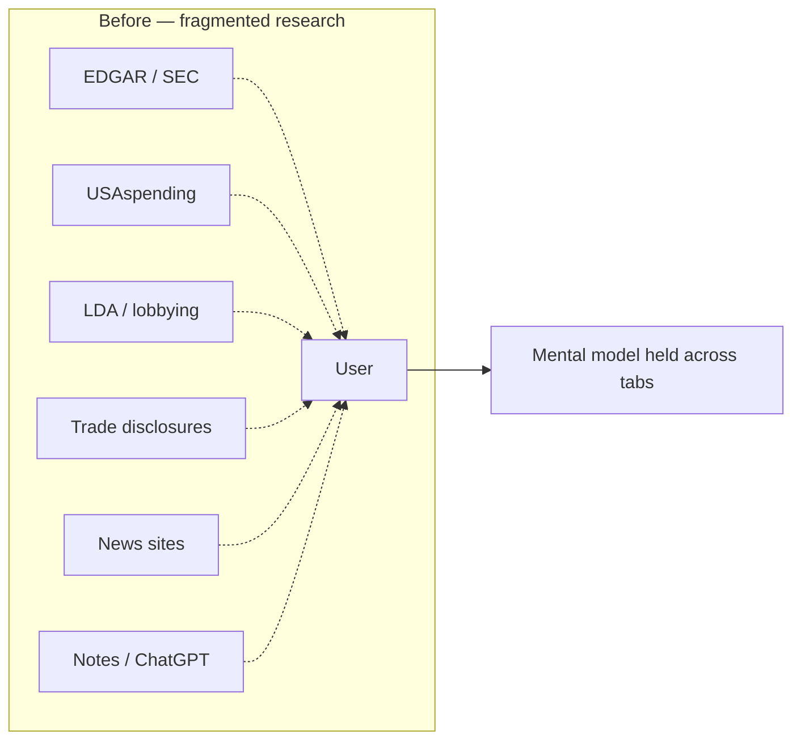
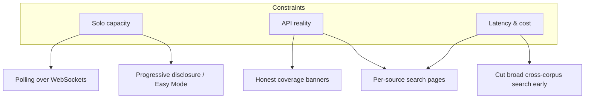
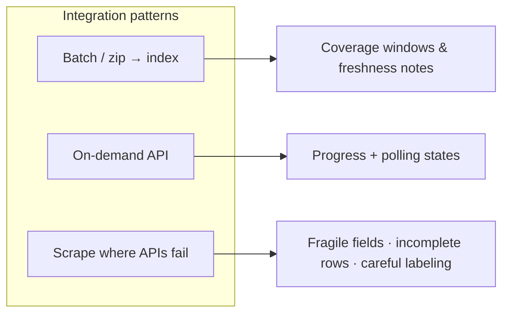
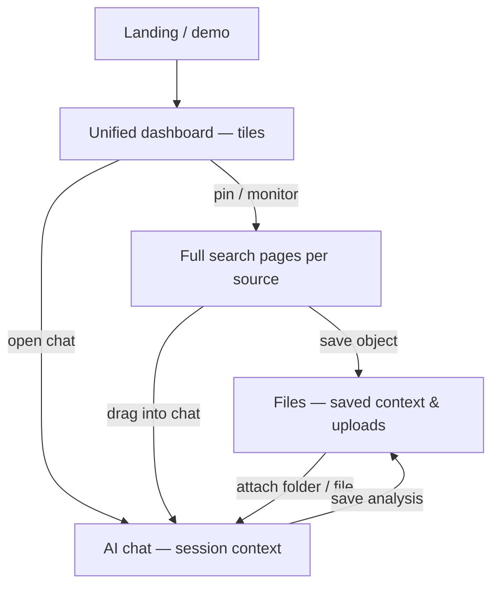
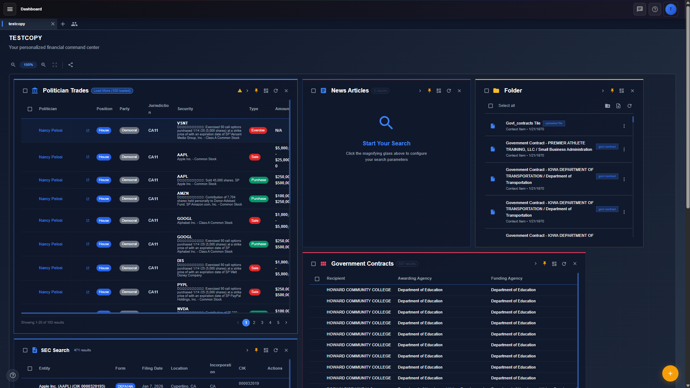
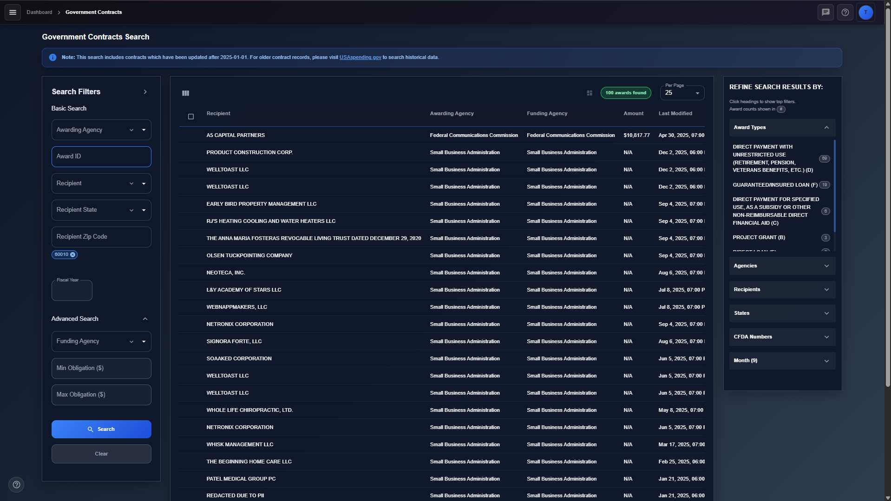
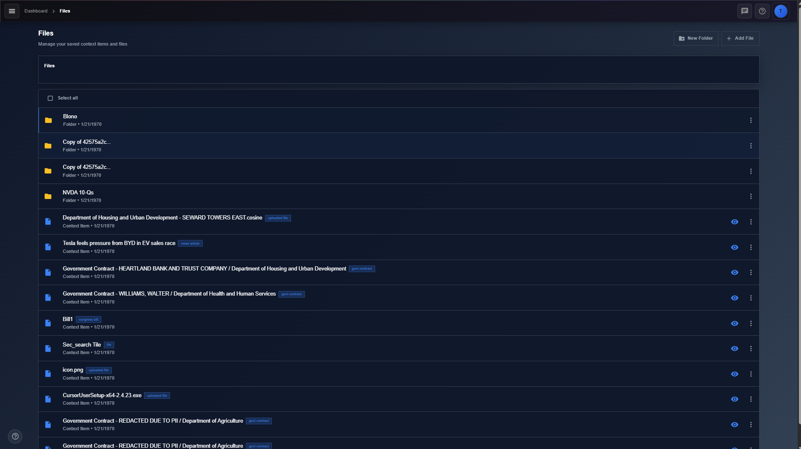
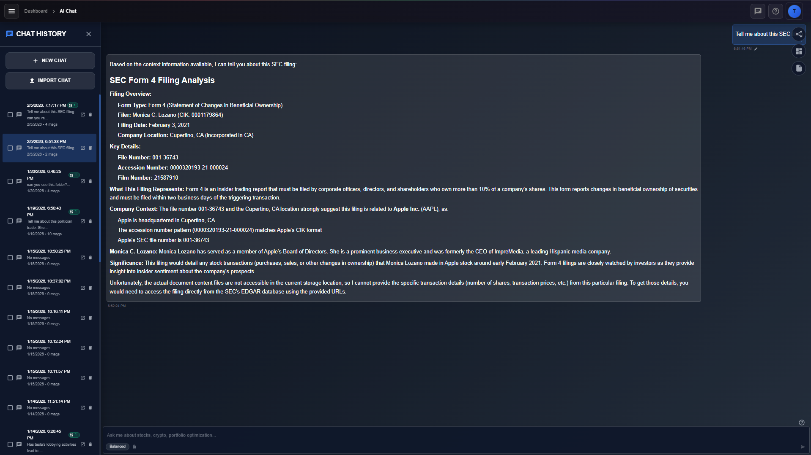
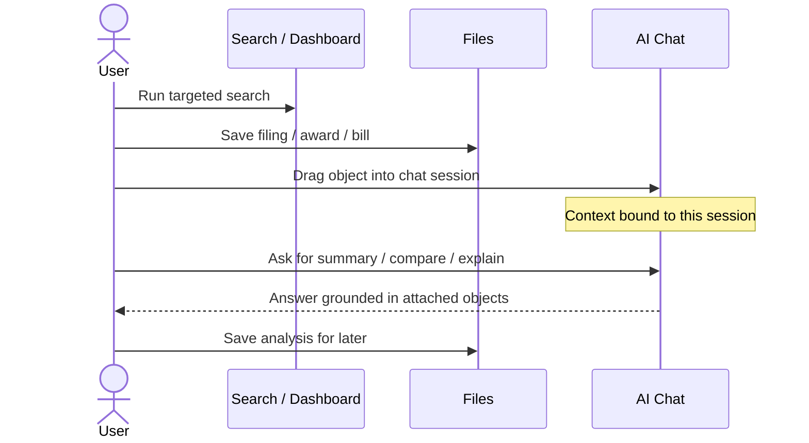
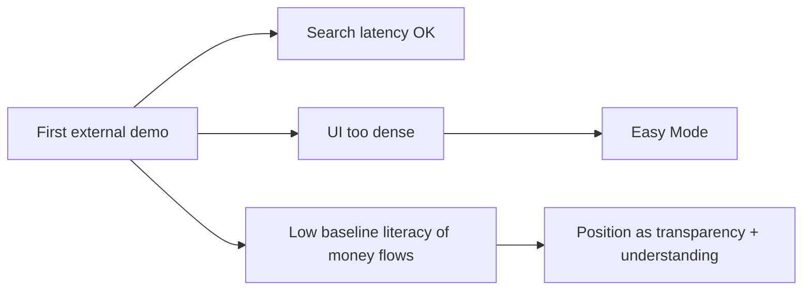

# FinGov

### Designing a research workspace for following the money

**Product** · [fingov.ai](https://fingov.ai)  
**Role** · Solo product designer & engineer (end-to-end)  
**Timeline** · Side project → live platform  
**Case study page** · This document (no separate deck)  
**Visuals** · Flows, decision diagrams, and final UI from the product

*Public product. Proprietary indexing and scraping details are described at a high level.*

---

## Overview

FinGov is a government and financial research platform I designed and built alone. It started as a tool for investors who wanted decisions grounded in SEC filings, news, and market data. Following capital from markets into government spending pulled the product toward transparency: contracts, congressional trading, lobbying, campaign contributions, and related disclosures — still in one workspace, with an AI assistant that only sees what the user attaches.

The design problem was not “add another search box.” It was: **how do you make fragmented public data feel like one research practice** — find, save, analyze — without drowning non-experts in filters or forcing power users into a toy UI.

---

## The problem

### Who had it

Early users were people trying to make **data-backed investment connections**. Traditional sources — filings, news, price trends — were necessary but incomplete. Optimal answers kept pointing at government: who got the contract, who traded the stock, who lobbied whom.

Before FinGov, that work looked like this:



Each source lived on its own site, in its own vocabulary. Users pasted fragments into notes or a generic chatbot that had no durable link to the filing, award, or bill itself. Context evaporated between sessions.

### What I knew going in

I knew the workflow because I was designing for the same job I was doing: following money until the trail crossed agency boundaries. Later demos with people in local politics confirmed a sharper version of the problem — many were not already fluent in how tax dollars and influence actually move. Speed of lookup mattered; **legibility of the system** mattered more.

---

## Goals

1. One workspace for market and government sources that matter to “follow the money.”
2. A path from discovery → deep search → durable files → AI analysis on *selected* context.
3. Interfaces that stay usable for curious non-experts *and* for heavy filter users.
4. Ship and operate as a solo builder — every interaction had to be maintainable on real APIs and AWS constraints.

---

## Constraints

| Constraint | How it shaped design |
|------------|----------------------|
| Solo ownership of FE, BE, devops, AI, security | Prefer patterns I could learn and operate; reuse over one-off infra |
| AI-assisted development for speed | I still owned vision and reuse (e.g. shared DynamoDB Terraform module across tables) |
| Heterogeneous APIs | Search UX had to respect batch zip indexes vs on-demand calls vs scraping |
| Rate limits & formats | Coverage notes, progress states, and “what’s searchable” honesty in the UI |
| Latency on growing indexes | Targeted per-source search over an early mega open search |



---

## Exploration — directions I rejected

The interesting work was not the final screens. It was the forks that did not ship (or shipped only partly).

```mermaid
flowchart TD
  Ideal["Ideal: Cursor-style dashboard + side chat only"]
  Ideal -->|Heavy search cramped in tiles"| Pages["Add full pages per integration"]
  Ideal -->|"Keep for overview"| Dash["Dashboard tiles + ambient chat"]

  Ctx1["Right-click → add to context"] -->|"Too hidden / slow"| Ctx2["Drag objects into chat"]

  Broad["Open text search across all sources"] -->|"Too slow as indexes grew"| Narrow["Targeted search per source"]
  Narrow -.->|"Revisit as catalog grows"| Broad2["Future: nearest-match fan-out e.g. Apple"]

  Realtime["WebSockets / SSE for search progress"] -->|"Infra cost for solo"| Poll["DynamoDB + polling ~1–2s"]
```

### 1. Workspace-only vs. tiles + pages

I wanted everything reachable from a customizable dashboard with a Cursor-like chat on the side. That model is excellent for *ambient* research. It failed for *heavy* search: filters, facets, and result tables need width and height tiles cannot give.

**Cut:** Tile-only deep search.  
**Shipped:** Dashboard for composition and monitoring; dedicated pages for each integration when the work gets serious.

### 2. Context attachment

Early flow: right-click → add to context. Precise, but easy to miss and slow in a multi-object session.

**Cut:** Right-click as the primary path.  
**Shipped:** Drag filings and research objects into chat so context feels like moving evidence onto the desk.

### 3. Broad search vs. targeted search

A single open-text query across every index was attractive (“Apple” → news + SEC + trades + lobbying). I cut it in favor of **per-source targeted search** so response times stayed usable.

That tradeoff was right early. With many integrations live, bringing back nearest-match cross-source search is now an intentional next step — not a nostalgia feature.

### 4. How data arrives is a UX decision



Politician trades, for example, required scraping where APIs were inadequate. Users feel that as uneven richness — design had to absorb inconsistency instead of pretending every source is EDGAR-quality.

---

## Solution — information architecture



**Core loop:** discover on the dashboard → deepen on a full search page → capture into Files → analyze in chat on attached context → return to saved work later.

---

## Final UI

Live product: **[fingov.ai](https://fingov.ai)**  
Source screenshots (also used on the marketing landing page):

### 1 · Dashboard — compose a research surface



Custom tiles for trades, news, folders, SEC, contracts, and more. This is the “command center” view — overview and arrangement, not the place for the densest filters.

### 2 · Full search page — room to analyze



Dedicated contracts search: basic + advanced filters, results table, refine facets. This layout exists because the tile experiment failed for serious queries. Coverage messaging (what’s indexed vs. historical on the source site) is part of the design, not a footnote.

### 3 · Files — durable evidence



Saved context items and uploads — contracts, bills, news, SEC-related folders, `.cosine` artifacts — so research survives the browser tab that found it.

### 4 · AI chat — analysis on selected context



Chat is grounded in what the user attached, not a generic market monologue. History, import, and session context make analysis a first-class artifact alongside Files.

---

## Interaction detail — context into chat



---

## Ownership & collaboration

I owned problem framing, information architecture, UI, onboarding, and engineering end to end. There was no design team.

Research partners were **users**: I took shareable builds to local political meetings for both parties, demoed, and implemented feedback. One concrete outcome — a **campaign contributions** surface — came from a request by a campaign manager for my district’s House representative (identity kept anonymized here).

---

## Outcomes — what happened after people used it

The first meaningful “launch” signal was not a dashboard metric. It was a live demo on an **older machine with unstable internet**.

| Expectation | Observation | Design response |
|-------------|-------------|-----------------|
| Search would feel slow off good hardware | Search stayed surprisingly fast | Confirmed targeted indexing / per-source search |
| Layout would transfer fine | Pages felt cramped — too many indexes / fields visible | Shipped **Easy Mode**: common fields only, less visual noise; advanced remains for power users |
| Political audiences “already know” the money map | Many did not | Product job expanded from faster lookup → making money flows legible |



I am not citing vanity marketing numbers as evidence. The validated learning was qualitative and behavioral: density hurt first; mental models were weaker than expected; Easy Mode and contribution-oriented requests followed from real sessions.

---

## If I did it again

1. **Map every integration before freezing search UX** — batch vs on-demand vs scrape, rate limits, field completeness — so empty states and honesty banners are designed with the data, not patched after.
2. **Draw the full source catalog earlier** — knowing the eventual surface area would have timed the return of cross-source open search better.
3. **Prototype simple vs advanced sooner** — Easy Mode should have been a first-class IA bet, not only a reaction to a cramped demo.
4. **Reintroduce nearest-match fan-out** — “Apple” should surface news, filings, trades, and lobbying in one pass now that the catalog justifies it.

---

## Artifacts

| Artifact | Link / location |
|----------|-----------------|
| Live case study surface | [fingov.ai](https://fingov.ai) |
| This write-up | [`docs/FinGov-Product-Design-Case-Study.md`](./FinGov-Product-Design-Case-Study.md) |
| Final UI screenshots | `frontend/react-app/public/screenshots/` |
| Formal Figma / pitch deck | None — thinking is shown via flows above and shipped UI |

---

## Summary

FinGov is a case study in designing under fragmentation: many public sources, one research practice, solo delivery. The shipped system keeps a Cursor-inspired dashboard and chat, adds full pages where tiles failed, treats context as drag-and-drop evidence, and uses Easy Mode so transparency tools do not only serve experts. The cuts — especially early broad search — were deliberate performance choices I would partially reverse with a clearer map of integrations next time.
